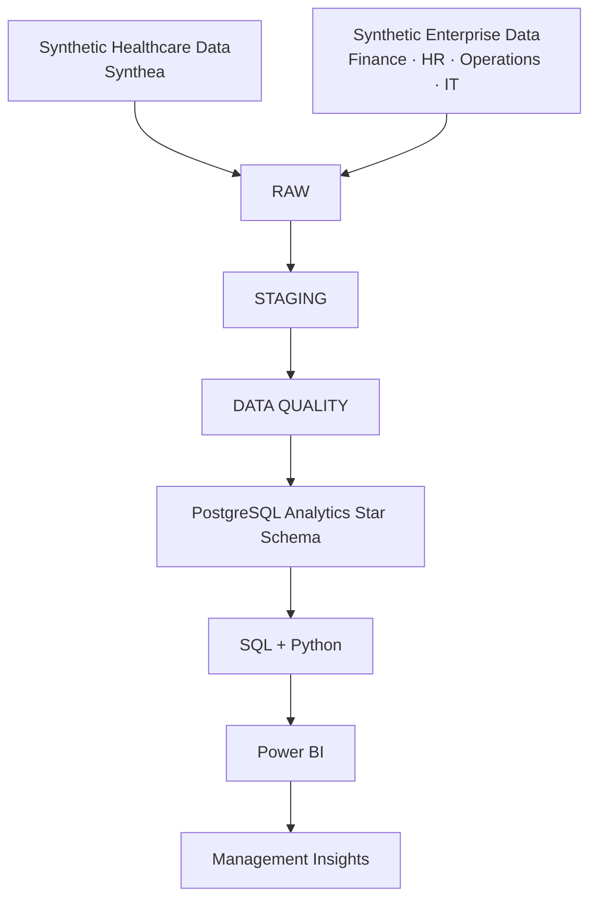
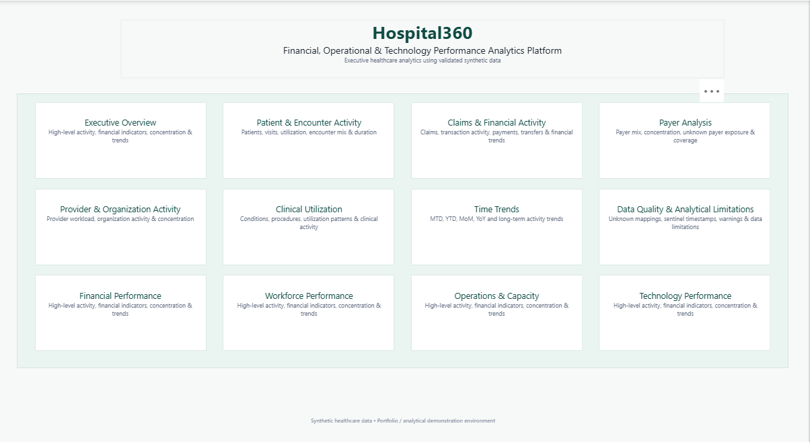
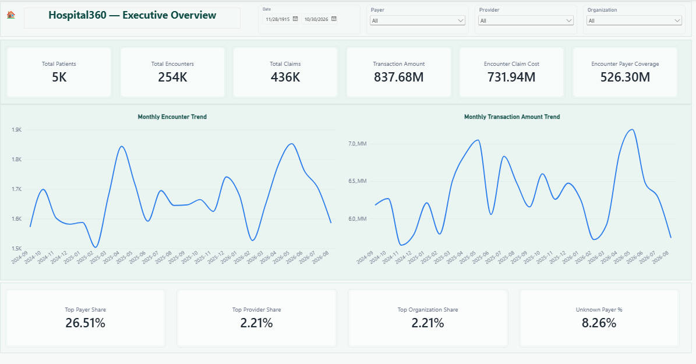
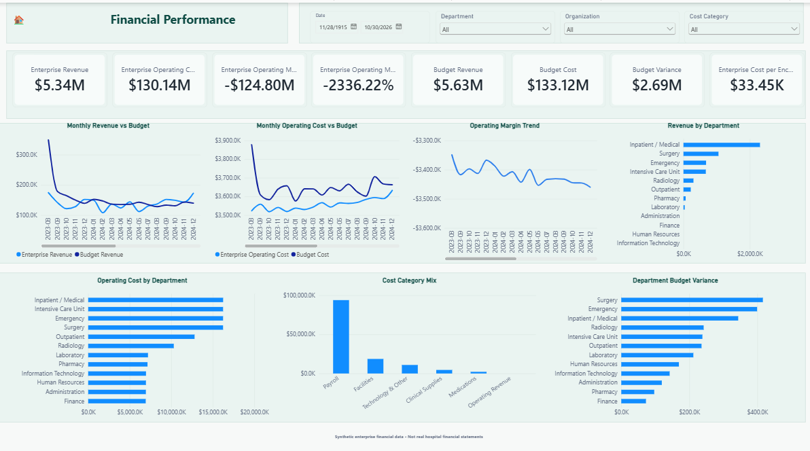
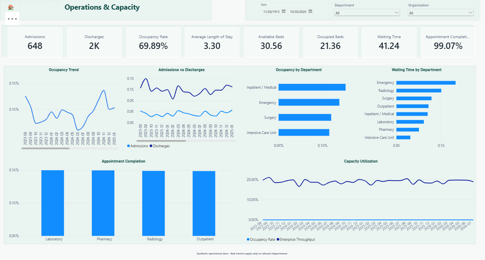
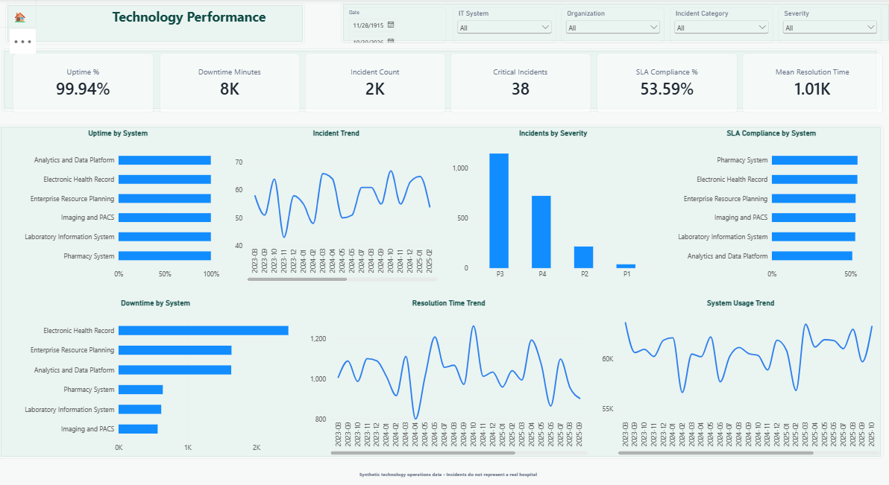

# Hospital360

## Financial, Operational & Technology Performance Analytics Platform

Hospital360 is a production-style healthcare and hospital enterprise performance analytics platform built with realistic synthetic data. It combines PostgreSQL, SQL, Python, and Power BI across patient activity, claims, finance, workforce, operational capacity, and technology reliability.

> **Portfolio disclosure:** Hospital360 uses synthetic data only. It contains no real patient, employee, customer, company, or hospital financial data and was not deployed inside a real hospital.

## Executive Summary

The project demonstrates an end-to-end analytics lifecycle:

```text
Synthetic sources → RAW → STAGING → DATA QUALITY → STAR SCHEMA
                  → SQL + PYTHON → POWER BI → MANAGEMENT INSIGHTS
```

Healthcare activity comes from Synthea. A separate deterministic enterprise generator creates synthetic Finance, Workforce, Operations, and IT data. The two domains share governed dimensions without treating healthcare claims as hospital revenue or profitability.

## Business Problem

Hospital leaders need a consistent view of patient activity, financial performance, workforce capacity, operational pressure, and technology reliability. Those domains often arrive at different grains and can produce misleading totals when joined directly. Hospital360 addresses that problem with source-preserving ingestion, explicit data-quality controls, dimensional modeling, reconciled KPIs, and management-ready dashboards.

## Project Objectives

- Build a reliable, traceable healthcare analytics architecture.
- Validate source data before it reaches reporting models.
- Integrate clinical activity and enterprise performance at governed shared dimensions.
- Define reusable SQL, Python, and DAX metrics at correct fact grains.
- Deliver a navigable executive Power BI report.
- Demonstrate production-style analytics engineering, testing, documentation, and Git practices.

## Architecture



Detailed design: [Architecture documentation](docs/architecture/README.md).

## Technology Stack

| Area | Technologies |
|---|---|
| Database and modeling | PostgreSQL, SQL, star schemas |
| Data engineering | Python, pandas, deterministic generators |
| Analysis | SQL, Python, Jupyter, NumPy, seaborn, Matplotlib |
| Business intelligence | Power BI, DAX, Power Query, PBIP/PBIR |
| Source and delivery | Synthea, Git, GitHub |

## Data

### Synthetic healthcare dataset

- Final analytical population: **5,000 patients**.
- Core domains: encounters, claims, claim transactions, conditions, and procedures.
- Validated facts: **253,563 encounters**, **435,751 claims**, **3,966,064 claim transactions**, **696,202 procedures**, and **159,348 condition occurrences**.
- An earlier 20,000-patient run served as a scalability/stress test. The final working analytical dataset uses 5,000 patients for practical local execution.

### Synthetic enterprise extension

- 36 complete months: **2023-08-01 through 2026-07-31**.
- **25,716** final enterprise fact rows.
- Domains: Finance, Budget, Workforce, Operations, IT Incidents, and IT System performance.

Multi-gigabyte generated RAW files are intentionally excluded from Git. Small public examples are available in [`data/sample/`](data/sample/).

## Analytical Domains

### Healthcare analytics

- Executive Overview
- Patient & Encounter Activity
- Claims & Financial Activity
- Payer Analysis
- Provider & Organization Activity
- Clinical Utilization
- Time Trends
- Data Quality & Analytical Limitations

### Enterprise performance

- Financial Performance
- Workforce Performance
- Operations & Capacity
- Technology Performance

## Data Model

Hospital360 uses analytics-ready star schemas with surrogate keys, conformed Date and Organization dimensions, single-direction filtering, and Unknown members where source references are missing. Enterprise facts also share Department and domain-specific dimensions. Facts remain at their native grains; there are **no fact-to-fact relationships**.

See the [healthcare star schema](docs/architecture/analytics_star_schema.md), [enterprise star schema](docs/architecture/enterprise_star_schema.md), [data dictionaries](docs/data_dictionary/), and [KPI dictionaries](docs/kpi_dictionary/).

## Data Quality Strategy

```text
SOURCE → RAW parity → STAGING validation → DQ classification
       → ANALYTICS reconciliation → KPI validation
```

Enterprise findings are classified as `ERROR`, `WARNING`, or `BUSINESS_ANOMALY`. The accepted extension has **0 fatal errors**, **633 warnings**, and **1,257 retained business anomalies**. Warnings and anomalies are review signals, not automatically invalid rows.

Healthcare source sentinel timestamps and Unknown members are preserved when analytically appropriate so missing or source-specific values remain visible rather than being silently discarded.

## SQL Analytics

The read-only SQL framework validates KPIs, reconciles facts, performs safe aggregation, and supports healthcare and enterprise cross-domain analysis without multiplying amounts. Explore the scripts in [`sql/analysis/`](sql/analysis/) and the [SQL findings](docs/insights/sql_5k_findings.md).

## Python Analytics

The reproducible Python layer uses aggregated read-only database queries for distributions, trends, outlier inspection, and cross-domain associations. Outliers are retained, and associations are not described as causal.

- [Enterprise EDA notebook](notebooks/02_enterprise_performance_eda.ipynb)
- [Healthcare Python findings](docs/insights/python_eda_findings.md)
- [Enterprise Python findings](docs/insights/enterprise_python_findings.md)

## Power BI Dashboard

The version-controlled PBIP/PBIR report contains **13 pages** and **12 Home navigation tiles**, grouped into Healthcare Analytics and Enterprise Performance. PBIP/PBIR source is committed for review; the large, redundant local PBIX binary is intentionally excluded.

See the [final report inventory](docs/architecture/powerbi_final_report_inventory.md), [enterprise Power BI inventory](docs/architecture/enterprise_powerbi_inventory.md), and [full dashboard gallery](docs/screenshots/README.md).

## Dashboard Preview

### Home



### Executive Overview



### Financial Performance



### Operations & Capacity



### Technology Performance



View all seven pages in the [dashboard screenshot gallery](docs/screenshots/README.md).

## Key KPIs

| Domain | Selected KPIs |
|---|---|
| Healthcare | Patients, Encounters, Claims, Transaction Amount, Payer Coverage, Encounters per Patient, Claims per Encounter, Procedures per Encounter, Unknown Payer %, Unknown Transaction Payer % |
| Enterprise Finance | Revenue, Operating Cost, Operating Margin, Budget Variance, Cost per Encounter |
| Workforce | Headcount, FTE, Payroll Cost, Overtime, Absence Rate, Turnover Rate, Encounters per FTE |
| Operations | Admissions, Discharges, Occupancy Rate, Average Length of Stay, Waiting Time, Appointment Completion % |
| Technology | Uptime %, Downtime Minutes, Incident Count, Critical Incidents, SLA Compliance %, Mean Resolution Time |

Definitions and grain rules are in the [KPI dictionaries](docs/kpi_dictionary/).

## Selected Synthetic Analytical Findings

- 5,000 synthetic patients generated 253,563 encounters, or approximately **50.71 encounters per patient**.
- Claims per encounter are approximately **1.72**; procedures per encounter are approximately **2.75**.
- The leading transaction payer represents approximately **26.51%** of transaction amount.
- Unknown primary payer affects approximately **8.26%** of claims; Unknown transaction payer affects approximately **4.32%** of transaction rows.
- The enterprise scenario contains $5.34M synthetic operating revenue, $130.14M synthetic operating cost, and 25,716 fact rows across 36 months.
- IT system activity totals 2.18M synthetic transactions with **99.9374%** weighted uptime; 38 of 2,132 incidents are P1.

These are **synthetic analytical findings**, not real hospital results. Full interpretation and limitations are documented in [healthcare SQL findings](docs/insights/sql_5k_findings.md) and [enterprise SQL findings](docs/insights/enterprise_sql_findings.md).

## Repository Structure

```text
Hospital360/
├── data/
│   └── sample/
├── docs/
├── notebooks/
├── powerbi/
├── sql/
├── src/
├── tests/
├── tools/
├── README.md
├── requirements.txt
├── LICENSE
└── CHANGELOG.md
```

## Limitations

- All data is synthetic; no real patient records or confidential organization data are included.
- Synthea claim/activity fields are not hospital profitability or a real P&L.
- The separate enterprise finance layer is synthetic and is not an audited financial statement.
- Department allocation is a reproducible synthetic operating model, not clinical truth.
- Analytical associations do not prove real-world causation.
- Unknown and sentinel records are retained where analytically appropriate.
- Hospital360 is a portfolio system, not a production hospital deployment.

## Getting Started and Documentation

- [Setup and run guide](docs/SETUP.md)
- [Documentation index](docs/README.md)
- [Architecture summary](docs/architecture/README.md)
- [Contributing](CONTRIBUTING.md)
- [Security and privacy](SECURITY.md)
- [Changelog](CHANGELOG.md)

Licensed under the [MIT License](LICENSE).
