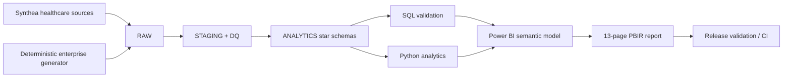
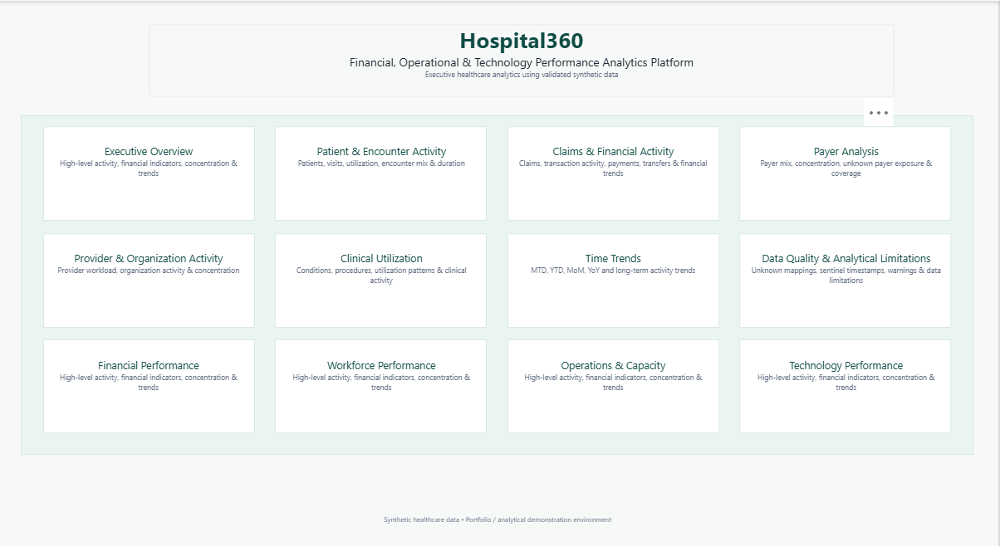
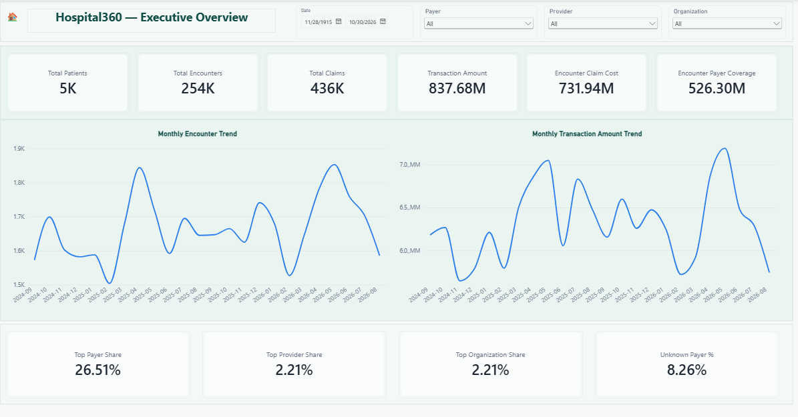
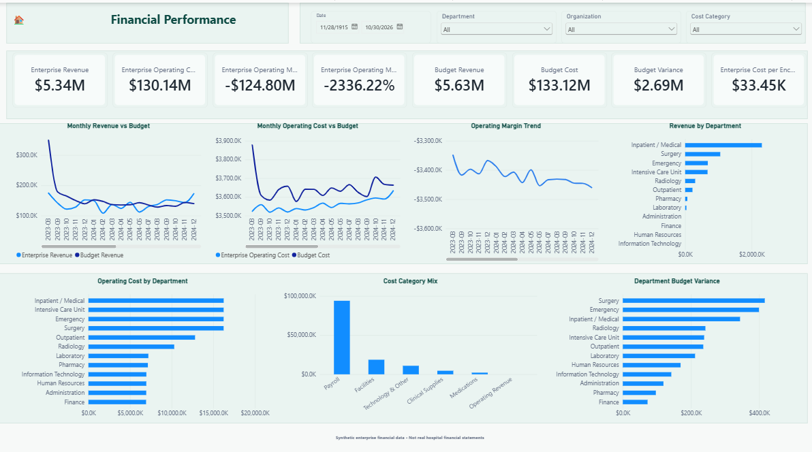
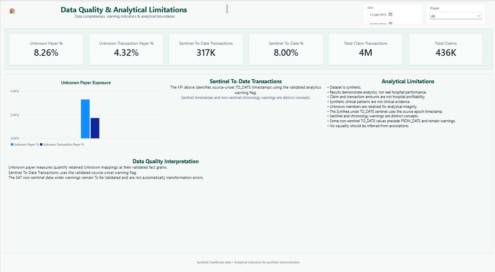

# Hospital360

## Synthetic Healthcare & Enterprise Analytics Platform

[](https://github.com/khaledzidan203-stack/Hospital360/actions/workflows/repository-validation.yml)

Hospital360 is an end-to-end hospital analytics implementation that combines **synthetic healthcare activity and claims** with a separately governed **enterprise performance layer** for Finance, Workforce, Operations, and Technology. The project covers source generation, PostgreSQL data engineering, data quality, dimensional modeling, SQL/Python analytics, Power BI semantic engineering, and release validation.

> **Data boundary:** all patient, claim, financial, workforce, operations, and IT data is synthetic. Hospital360 contains no real patient records, employee records, confidential organization data, or audited hospital financial statements.


**Start here:** [Case study](docs/CASE_STUDY.md) · [Technical walkthrough](docs/TECHNICAL_WALKTHROUGH.md) · [Evidence map](docs/PROJECT_EVIDENCE_MAP.md) · [Project index](docs/PROJECT_INDEX.md) · [Setup](docs/SETUP.md)

## Project at a glance

| Area | Implemented state |
|---|---|
| Healthcare source | Synthea synthetic healthcare data |
| Enterprise source | Deterministic synthetic Finance, Budget, Workforce, Operations, and IT generator |
| Healthcare working baseline | 5,000 synthetic patients · 5,515,928 RAW rows |
| Healthcare analytical facts | 5 facts: Encounter, Claim, Claim Transaction, Condition Occurrence, Procedure |
| Enterprise extension | 36 months · 25,716 fact rows · 6 enterprise facts |
| Database architecture | PostgreSQL `RAW → STAGING → ANALYTICS` |
| Analysis | Read-only SQL + Python/Jupyter analytical layer |
| Power BI | PBIP/PBIR/TMDL · current 13-page report · 12 Home tiles |
| Validation | RAW/STAGING/ANALYTICS reconciliation · SQL regression · DQ · repository CI |
| Scale testing | Clean 20K source generated and RAW-loaded; STAGING bottleneck documented, full 20K pipeline not claimed complete |

## Why the architecture matters

Hospital performance data does not live at one grain. Patient activity, claims, budgets, staffing, bed/capacity operations, and technology reliability describe different processes. Flattening them into one table or joining facts directly can multiply amounts and create false relationships.

Hospital360 therefore enforces a few core rules:

1. **Preserve source grain before aggregation.**
2. **Keep healthcare and enterprise facts separate.**
3. **Use governed dimensions instead of fact-to-fact relationships.**
4. **Do not treat Synthea claim values as hospital revenue or profitability.**
5. **Retain data-quality warnings and anomalies rather than silently deleting them.**
6. **Reconcile every major pipeline boundary before reporting.**

## End-to-end architecture


```mermaid
flowchart LR
    H[Synthea healthcare sources] --> R[RAW]
    E[Deterministic enterprise generator] --> R
    R --> S[STAGING + DQ]
    S --> A[ANALYTICS star schemas]
    A --> Q[SQL validation]
    A --> Y[Python analytics]
    Q --> P[Power BI semantic model]
    Y --> P
    P --> B[13-page PBIR report]
    B --> V[Release validation / CI]
```

Detailed design: [Architecture summary](docs/architecture/README.md).

## 1. Synthetic healthcare pipeline

The accepted analytical baseline contains exactly **5,000 synthetic patients**. The approved healthcare RAW sources reconcile to **5,515,928 rows**:

| Healthcare fact | Validated rows |
|---|---:|
| Encounters | 253,563 |
| Claims | 435,751 |
| Claim transactions | 3,966,064 |
| Condition occurrences | 159,348 |
| Procedures | 696,202 |

The healthcare model also uses governed Date, Patient, Provider, Organization, Payer, Condition, and Procedure dimensions with surrogate keys and explicit Unknown-member handling where appropriate.

The optimized STAGING V2 pipeline preserved V1 business rules while improving execution. At the validated 5K scale, RAW-to-STAGING differences are **0**, STAGING-to-fact differences are **0**, duplicate fact grains are **0**, broken required lookups are **0**, and validated financial reconciliation differences are **0.00**.

See [portfolio scale validation](docs/architecture/portfolio_scale_validation.md) and [healthcare star schema](docs/architecture/analytics_star_schema.md).

## 2. Synthetic enterprise extension

A deterministic generator extends Hospital360 with a separate **36-month** enterprise scenario from **2023-08-01 through 2026-07-31**.

| Enterprise fact | Rows |
|---|---:|
| Finance Monthly | 2,592 |
| Budget Monthly | 1,296 |
| Workforce Monthly | 2,160 |
| Operations Daily | 8,768 |
| IT Incident | 2,132 |
| IT System Daily | 8,768 |
| **Total** | **25,716** |

Generation progressed through 1-, 3-, 12-, and 36-month acceptance gates before the final snapshot entered PostgreSQL. The accepted extension records **0 fatal DQ errors**, while retaining **633 warnings** and **1,257 business anomalies** as review signals.

Healthcare activity can act as an aggregated synthetic operating driver, but enterprise facts do not contain Patient, Encounter, or Claim foreign keys. Claims remain claims; enterprise finance remains a separate synthetic business layer.

See [enterprise implementation](docs/architecture/enterprise_implementation.md) and [enterprise star schema](docs/architecture/enterprise_star_schema.md).

## 3. PostgreSQL analytical model

The database follows a layered design:

```text
SOURCE
  ↓
RAW          source-preserving landing
  ↓
STAGING      typing · normalization · DQ flags
  ↓
ANALYTICS    dimensions · facts · governed grains
```

The analytical schemas use surrogate keys, conformed Date and Organization dimensions, domain-specific dimensions, explicit Unknown members, and no direct fact-to-fact relationships.

SQL under [`sql/analysis/`](sql/analysis/) is read-only and validates safe aggregation, KPI behavior, reconciliation, and cross-domain analysis without multiplying amounts.

At the accepted 5K healthcare scale, the regression framework executed **47/47 SQL queries successfully**, with **0 failed queries** and **0 validation failures**.

## 4. Python analytical layer

Python supports read-only exploratory analysis, distributions, trends, outlier inspection, and cross-domain associations. The database connector restricts analytical queries to read-only behavior, and documented associations are not described as causal.

Key entry points:

- [Healthcare Python findings](docs/insights/python_eda_findings.md)
- [Enterprise Python findings](docs/insights/enterprise_python_findings.md)
- [Healthcare EDA notebook](notebooks/01_hospital360_eda.ipynb)
- [Enterprise EDA notebook](notebooks/02_enterprise_performance_eda.ipynb)

## 5. Power BI semantic model and report

The current version-controlled Power BI project contains:

- PBIP entry point;
- PBIR report source;
- TMDL semantic-model source;
- governed healthcare and enterprise business tables;
- DAX measures grouped by analytical domain;
- **13 report pages**;
- **12 Home navigation tiles**.

The current report spans healthcare activity, claims, payer/provider analysis, clinical utilization, time trends, data quality, financial performance, workforce, operations/capacity, and technology performance.

The historical file `docs/architecture/powerbi_final_report_inventory.md` documents the **nine-page healthcare baseline**. The later enterprise extension retained those pages and added four enterprise pages, producing the current 13-page integrated release documented in [Enterprise Power BI Inventory](docs/architecture/enterprise_powerbi_inventory.md).

### Power BI time-model note

The saved model has an explicit governed `analytics dim_date`, but Power BI Auto Date/Time is also still enabled and LocalDateTable artifacts remain in TMDL. Those artifacts are documented as a model-hygiene item rather than deleted blindly from source control. Safe remediation requires Power BI Desktop dependency and regression checks. See [Power BI Time-Intelligence Audit](docs/architecture/POWER_BI_TIME_INTELLIGENCE_AUDIT.md).

## 6. Validation and engineering evidence

| Validation layer | Recorded result |
|---|---|
| Accepted healthcare population | Exactly 5,000 synthetic patients |
| Source → RAW | Core source count differences = 0 |
| RAW → STAGING | Differences = 0 across six healthcare tables |
| STAGING V1/V2 parity sample | 17,165 rows; typed-value/DQ/hash differences = 0 |
| STAGING → healthcare facts | Differences = 0 across all five facts |
| Duplicate fact grains | 0 |
| Broken required lookups | 0 |
| SQL regression | 47 / 47 successful; 0 validation failures |
| Enterprise generation | 36-month final profile PASS; 25,716 fact rows |
| Enterprise DQ | 0 fatal errors; 633 warnings; 1,257 retained anomalies |
| Power BI current structure | 13 pages; 12 Home actions |
| Repository validation | Clone-safe static checks + unit tests in GitHub Actions |

The project preserves unresolved source behavior rather than silently correcting it. For example, known Synthea sentinel timestamps remain visible, and 547 non-sentinel transaction date-order warnings remain documented as **To Be Validated**.

## 7. Scalability test: what the 20K result actually means

A clean Synthea generation with overflow disabled produced exactly **20,000 patients**, and the approved RAW sources loaded successfully. During STAGING, the claims insert remained active for multiple hours with PostgreSQL `DataFileRead` I/O waits and no blocking backend.

The 20K pipeline was therefore **not completed** and is not presented as a successful end-to-end production run. The validated working release remains the 5K pipeline. This distinction is intentionally documented as an engineering scalability finding.

## Power BI preview

The repository stores **7 representative screenshots** from the current **13-page** report.

### Home



### Executive Overview



### Financial Performance



### Data Quality & Analytical Limitations



See the [representative screenshot gallery](docs/screenshots/README.md) for all seven saved captures.

## KPI domains

| Domain | Examples |
|---|---|
| Healthcare | Patients, Encounters, Claims, Claim Transactions, Payer Coverage, Procedures, Unknown Payer exposure |
| Finance | Revenue, Operating Cost, Operating Margin, Budget Variance, Cost per Encounter |
| Workforce | Headcount, FTE, Payroll Cost, Overtime, Absence, Turnover, Encounters per FTE |
| Operations | Admissions, Discharges, Occupancy, Average Length of Stay, Waiting Time, Appointment Completion |
| Technology | Uptime, Downtime Minutes, Incidents, P1 Incidents, SLA Compliance, Resolution Time |

Definitions and grain rules are documented in the [KPI dictionaries](docs/kpi_dictionary/).

## Reproduce the project

Prerequisites and complete run order are documented in [Setup and Run Guide](docs/SETUP.md). The high-level local sequence is:

```powershell
git clone https://github.com/khaledzidan203-stack/Hospital360.git
cd Hospital360
python -m venv .venv
.\.venv\Scripts\Activate.ps1
python -m pip install -r requirements.txt
python scripts/validate_repository.py
python -m unittest discover -s tests -p "test_*.py" -v
```

Full healthcare reproduction additionally requires a locally generated Synthea source snapshot and PostgreSQL. Large RAW files, credentials, PBIX binaries, and Power BI caches are intentionally excluded from Git. See [Environment Baseline](docs/ENVIRONMENT_BASELINE.md).

## Repository structure

```text
data/          ignored generated RAW/processed data + public synthetic samples
docs/          architecture, governance, evidence, insights, screenshots
notebooks/     healthcare and enterprise Python EDA
powerbi/       PBIP, PBIR, TMDL, DAX/model source
scripts/       clone-safe repository validation
sql/           PostgreSQL DDL, staging, marts, analysis
src/           active analytics and enterprise-generation Python code
tests/         clone-safe tests plus local full-data acceptance checks
```

Reserved historical scaffold directories are explained in [Repository Structure Notes](docs/REPOSITORY_STRUCTURE_NOTES.md).

## Interpretation limits

- All data is synthetic; no real-world patient outcome or hospital-performance inference should be drawn from the values.
- Synthea claim/activity amounts are not hospital profitability or an audited P&L.
- Enterprise finance and workforce data are deterministic synthetic scenarios.
- Department allocation is a reproducible operating model, not clinical truth.
- Associations do not establish causality.
- Unknown and sentinel records are retained where analytically appropriate.
- The 20K test documents a scalability bottleneck; it is not a completed 20K end-to-end release.

## Documentation

[Project index](docs/PROJECT_INDEX.md) · [Architecture](docs/architecture/README.md) · [Documentation index](docs/README.md) · [Evidence map](docs/PROJECT_EVIDENCE_MAP.md) · [Security](SECURITY.md) · [Changelog](CHANGELOG.md)

Licensed under the [MIT License](LICENSE).
