# Hospital360 Analytics V1 Star Schema

**Status: Implemented V1 Analytical Model**

## Purpose

The `analytics` schema provides a curated dimensional model over the six validated Synthea staging tables. It preserves each approved event grain, supplies conformed dimensions for independent fact analysis, and retains source identifiers and hashes for lineage. It does not define KPI views or alter `raw` or `staging` data.

## Architecture

Data flows in one direction:

`Synthea CSV → raw → staging → analytics → Power BI / SQL / Python`

The implemented model contains seven dimensions and five facts. Facts relate to conformed dimensions only; no fact-to-fact foreign keys or analytical filtering relationships are implemented.

```mermaid
erDiagram
    DIM_DATE ||--o{ FACT_ENCOUNTER : "start/stop dates"
    DIM_PATIENT ||--o{ FACT_ENCOUNTER : patient
    DIM_PROVIDER ||--o{ FACT_ENCOUNTER : provider
    DIM_ORGANIZATION ||--o{ FACT_ENCOUNTER : organization
    DIM_PAYER ||--o{ FACT_ENCOUNTER : payer

    DIM_DATE ||--o{ FACT_CLAIM : "claim dates"
    DIM_PATIENT ||--o{ FACT_CLAIM : patient
    DIM_PROVIDER ||--o{ FACT_CLAIM : "provider roles"
    DIM_ORGANIZATION ||--o{ FACT_CLAIM : "encounter organization"
    DIM_PAYER ||--o{ FACT_CLAIM : "payer roles"

    DIM_DATE ||--o{ FACT_CLAIM_TRANSACTION : "from/to dates"
    DIM_PATIENT ||--o{ FACT_CLAIM_TRANSACTION : patient
    DIM_PROVIDER ||--o{ FACT_CLAIM_TRANSACTION : "provider roles"
    DIM_ORGANIZATION ||--o{ FACT_CLAIM_TRANSACTION : "place of service"
    DIM_PAYER ||--o{ FACT_CLAIM_TRANSACTION : "claim primary payer"

    DIM_DATE ||--o{ FACT_CONDITION_OCCURRENCE : "start/stop dates"
    DIM_PATIENT ||--o{ FACT_CONDITION_OCCURRENCE : patient
    DIM_CONDITION ||--o{ FACT_CONDITION_OCCURRENCE : condition
    DIM_PROVIDER ||--o{ FACT_CONDITION_OCCURRENCE : "encounter provider"
    DIM_ORGANIZATION ||--o{ FACT_CONDITION_OCCURRENCE : "encounter organization"
    DIM_PAYER ||--o{ FACT_CONDITION_OCCURRENCE : "encounter payer"

    DIM_DATE ||--o{ FACT_PROCEDURE : "start/stop dates"
    DIM_PATIENT ||--o{ FACT_PROCEDURE : patient
    DIM_PROCEDURE ||--o{ FACT_PROCEDURE : procedure
    DIM_PROVIDER ||--o{ FACT_PROCEDURE : "encounter provider"
    DIM_ORGANIZATION ||--o{ FACT_PROCEDURE : "encounter organization"
    DIM_PAYER ||--o{ FACT_PROCEDURE : "encounter payer"
```

## Dimensions

| Dimension | One row represents | Surrogate key | Natural/business key | Descriptive attributes and lineage | Uniqueness rule |
|---|---|---|---|---|---|
| `analytics.dim_date` | One calendar date, plus one Unknown member | `date_key` | `full_date` | Calendar year, quarter, month, day, ISO day/week fields | Unique `date_key` and `full_date` |
| `analytics.dim_patient` | One current-state Synthea patient | `patient_key` | `patient_id` | Birth/death dates, demographics, non-street geographic attributes, coordinates, source table/hash | Unique `patient_id` |
| `analytics.dim_provider` | One distinct provider identifier observed in approved staging references | `provider_key` | `provider_id` | Observed source-role flags and inferred-reference lineage | Unique `provider_id` |
| `analytics.dim_organization` | One distinct organization/place-of-service identifier observed in staging | `organization_key` | `organization_id` | Encounter/place-of-service role flags and inferred-reference lineage | Unique `organization_id` |
| `analytics.dim_payer` | One distinct payer identifier observed in encounter or claim payer roles | `payer_key` | `payer_id` | Encounter/primary/secondary payer role flags and inferred-reference lineage | Unique `payer_id` |
| `analytics.dim_condition` | One condition concept | `condition_key` | `code_system + condition_code` | Condition description and source lineage | Unique composite natural key |
| `analytics.dim_procedure` | One procedure concept | `procedure_key` | `code_system + procedure_code` | Procedure description and source lineage | Unique composite natural key |

`dim_provider`, `dim_organization`, and `dim_payer` are intentionally limited reference dimensions. The approved staging scope does not include the Synthea provider, organization, or payer master files, so V1 creates these dimensions from distinct staged references and does not invent names, specialties, addresses, or payer descriptions.

Direct synthetic PII-like patient identifiers and street/name fields, and patient lifetime financial snapshot values, remain outside the V1 analytics dimension. No SCD Type 2 history is implemented; all V1 dimensions use current-state semantics.

## Facts

| Fact | Supported dimension roles | Degenerate/source lineage identifiers | Source-supported measures |
|---|---|---|---|
| `analytics.fact_encounter` | Patient, provider, organization, payer, start date, stop date | `encounter_id`, source table/hash | Base encounter cost, total claim cost, payer coverage |
| `analytics.fact_claim` | Patient, provider roles, encounter organization, payer roles, claim dates | `claim_id`, `encounter_id`, department/type/diagnosis/status fields, source table/hash | Outstanding amounts for primary and secondary roles |
| `analytics.fact_claim_transaction` | Patient, provider roles, place-of-service organization, claim-primary payer, from/to dates | `transaction_id`, `claim_id`, `encounter_id`, `charge_id`, transaction descriptors, source table/hash | Units, amount, unit amount, payments, adjustments, transfers, outstanding |
| `analytics.fact_condition_occurrence` | Patient, condition concept, encounter-context provider/organization/payer, start/stop dates | `encounter_id`, source table/hash | No additive measure in V1 |
| `analytics.fact_procedure` | Patient, procedure concept, encounter-context provider/organization/payer, start/stop dates | `encounter_id`, source table/hash | Base cost |

Encounter, claim, and transaction identifiers retained on downstream facts are lineage/degenerate attributes. They are not foreign keys to other analytics facts.

## Fact Grains

- `fact_encounter`: one row per source encounter event; candidate business key `encounter_id` is unique in the validated extract.
- `fact_claim`: one row per source claim header; candidate business key `claim_id` is unique in the validated extract.
- `fact_claim_transaction`: one row per source financial transaction/event line; candidate business key `transaction_id` is unique in the validated extract.
- `fact_condition_occurrence`: one row per recorded condition occurrence. The validated candidate grain is patient + encounter + start date + condition code; the source row hash is retained for lineage.
- `fact_procedure`: one row per performed procedure occurrence. The validated candidate grain is patient + encounter + start timestamp + procedure code; the source row hash is retained for lineage.

The two composite occurrence grains remain candidates for validation on larger extracts; V1 does not impose a potentially row-rejecting unique constraint on them.

## Surrogate Keys

Each dimension has an integer surrogate key. Facts use bigint identity keys for physical row identity and integer foreign keys to dimensions. Source natural identifiers remain available for traceability and reconciliation.

All dimension surrogate keys and all validated business keys were checked after loading. Duplicate counts were zero for every dimension. Fact grain duplicate counts were also zero for all five facts.

## Natural Keys

- Patient: `patient_id`
- Provider: `provider_id`
- Organization: `organization_id`
- Payer: `payer_id`
- Condition: `code_system + condition_code`
- Procedure: `code_system + procedure_code`
- Date: `full_date` with deterministic integer `date_key` in `YYYYMMDD` form

These rules are enforced on dimensions. Source identifiers remain synthetic Synthea identifiers and are not enterprise master-data keys.

## Relationships

All physical analytics foreign keys point from a fact to a dimension. Encounter context is resolved from the unique staged encounter row while loading claims, conditions, and procedures. Claim-primary payer context is resolved from the unique staged claim header while loading transactions. These staging lookups enrich facts with conformed dimension keys but do not create analytics fact-to-fact relationships.

`dim_date` is role-playing through separate date-key columns appropriate to each fact, including encounter start/stop, claim service/billing, transaction from/to, condition start/stop, and procedure start/stop roles. Provider and payer foreign keys are likewise role-labeled where a fact contains more than one supported source role.

Validation found zero failed lookups for non-null staged patient, provider, organization, payer, condition, and procedure identifiers tested. The database contains zero foreign keys from one analytics fact to another.

## Unknown Member Strategy

Surrogate key `0` is the explicit `Unknown / Unmapped` member in every dimension. Every fact row is preserved: a missing or unmatched dimensional value maps to key `0` rather than causing row loss.

Observed nonzero V1 usage is explained by absent source roles or the validated Synthea timestamp sentinel, not failed non-null lookups:

| Fact role | Rows using key 0 | Explanation |
|---|---:|---|
| Claim primary payer | 124 | Primary insurance ID absent in the source claim |
| Claim secondary payer | 434 | Secondary insurance ID absent in the source claim |
| Claim referring provider | 464 | Referring provider absent in all source claims |
| Transaction claim-primary payer | 756 | Parent claim has no primary insurance ID |
| Transaction to date | 796 | Synthea unset stop timestamp serialized as Unix epoch; source timestamp is preserved and warning retained |

The 796 transaction rows retain `to_at = 1970-01-01T00:00:00Z` and set `source_unset_to_timestamp_warning = true`. Their analytical `to_date_key` is `0`, preventing the sentinel from being presented as a real transaction date. This is valid/expected source behavior, not a transformation error, chronological correction, or row-rejection rule.

## Date Dimension

`dim_date` contains every calendar date from `1916-11-09` through `2026-08-24`, inclusive. The 40,101 real calendar rows equal the calculated inclusive span of 40,101 days, so the gap count is zero. One additional key-0 Unknown member produces 40,102 physical rows.

The date dimension includes year, quarter, month number/name, year-month, day of month/name, ISO day of week, and week of year. It is generated from the full relevant staging range, not merely from distinct event dates. The known Unix-epoch unset stop sentinel is excluded from the range calculation and mapped to the Unknown member.

## Fact-to-Fact Join Risks

The source contains multiple claims per encounter and multiple transactions per claim. Directly joining `fact_encounter → fact_claim → fact_claim_transaction` before aggregation can multiply encounter costs, claim balances, encounter counts, claim counts, and patient counts.

Each fact must be aggregated at its own declared grain and compared through conformed dimensions. `encounter_id` and `claim_id` on facts are for lineage and controlled reconciliation only. They must not be used to construct a Power BI fact-to-fact relationship or to sum measures across mixed grains.

## Loading Order

The deterministic development reload script:

1. Truncates the explicit set of five facts and seven dimensions in one transaction-safe statement, with identity restart and without `CASCADE`.
2. Creates the key-0 Unknown members.
3. Generates the continuous date dimension.
4. Loads Patient, Provider, Organization, Payer, Condition, and Procedure dimensions.
5. Loads Encounter, Claim, Claim Transaction, Condition Occurrence, and Procedure facts.
6. Commits only if every statement succeeds because psql `ON_ERROR_STOP` and a database transaction are used.

The DDL uses `CREATE TABLE IF NOT EXISTS` and `CREATE INDEX IF NOT EXISTS`. A second execution skipped existing objects safely, and a second load reproduced the same row counts without duplication.

## Validation

### Dimension counts and uniqueness

Counts include the explicit Unknown member; business-member counts exclude it.

| Dimension | Physical rows | Business members | Duplicate surrogate keys | Duplicate business keys |
|---|---:|---:|---:|---:|
| `dim_date` | 40,102 | 40,101 | 0 | 0 |
| `dim_patient` | 11 | 10 | 0 | 0 |
| `dim_provider` | 31 | 30 | 0 | 0 |
| `dim_organization` | 31 | 30 | 0 | 0 |
| `dim_payer` | 9 | 8 | 0 | 0 |
| `dim_condition` | 69 | 68 | 0 | 0 |
| `dim_procedure` | 67 | 66 | 0 | 0 |

There were zero unexplained duplicate dimension members, zero non-null natural-key lookup failures, and zero invalid date foreign keys. PostgreSQL foreign-key constraints enforce date and conformed-dimension key validity.

### Fact row-count reconciliation

| Fact | Staging rows | Analytics rows | Difference | Status |
|---|---:|---:|---:|---|
| `fact_encounter` | 283 | 283 | 0 | Passed |
| `fact_claim` | 464 | 464 | 0 | Passed |
| `fact_claim_transaction` | 5,403 | 5,403 | 0 | Passed |
| `fact_condition_occurrence` | 252 | 252 | 0 | Passed |
| `fact_procedure` | 1,003 | 1,003 | 0 | Passed |
| **Total** | **7,405** | **7,405** | **0** | **Passed** |

The fact total is 7,405 because the patient source supplies a dimension rather than a fact. No source fact row was lost or multiplied.

## Reconciliation

Financial measures were compared between staging and analytics at the same grain, without joining facts.

| Measure | Staging total | Analytics total | Difference |
|---|---:|---:|---:|
| Encounter base cost | 33,801.26 | 33,801.26 | 0.00 |
| Encounter total claim cost | 518,472.87 | 518,472.87 | 0.00 |
| Encounter payer coverage | 145,968.31 | 145,968.31 | 0.00 |
| Claim outstanding 1 | 0.00 | 0.00 | 0.00 |
| Claim outstanding 2 | 0.00 | 0.00 | 0.00 |
| Claim outstanding primary | 0.00 | 0.00 | 0.00 |
| Transaction amount | 722,860.68 | 722,860.68 | 0.00 |
| Transaction unit amount | 537,616.96 | 537,616.96 | 0.00 |
| Transaction payments | 537,616.96 | 537,616.96 | 0.00 |
| Transaction adjustments | 0.00 | 0.00 | 0.00 |
| Transaction transfers | 370,487.44 | 370,487.44 | 0.00 |
| Transaction outstanding | 434,658.03 | 434,658.03 | 0.00 |
| Procedure base cost | 504,449.26 | 504,449.26 | 0.00 |

Every difference is zero. Analytics loading introduced no amount multiplication, and reproducing a fact's own totals requires only that fact.

Raw CSV SHA-256 hashes still match the hashes recorded in `raw_ingestion.md`. Raw and staging database row counts remained 10 patients, 283 encounters, 464 claims, 5,403 claim transactions, 252 conditions, and 1,003 procedures after both analytics executions. The analytics scripts contain no raw/staging writes.

## Known Limitations

- The model is based on a 10-patient synthetic smoke-test extract and requires validation on larger snapshots.
- Provider, organization, and payer dimensions are inferred from staged identifiers because their master sources are outside the approved six-table staging scope. Descriptive master attributes are unavailable in V1.
- Payer role semantics and claim financial fields remain source-specific and should not be mixed with encounter or transaction valuation bases without an approved business rule.
- Patient and other dimensions use current-state behavior; historical SCD Type 2 tracking is not implemented.
- Condition/procedure composite occurrence keys remain candidates pending larger-volume validation.
- No KPI measures, aggregate tables, materialized views, or Power BI model objects are included.

## Deferred V2 Enhancements

- Stage and conform the approved Synthea provider, organization, and payer master sources.
- Validate enterprise payer and provider identity rules and SCD requirements.
- Formalize claim lifecycle, insurance-role, and financial reconciliation semantics.
- Evaluate reusable encounter-type/code dimensions if cross-source hierarchies emerge.
- Add production load audit metadata, incremental loading, late-arriving dimension handling, and automated data-quality tests.
- Add governed KPI views and the Power BI semantic model only after measure definitions are approved.
