# Hospital360 Enterprise Star Schema

**Implementation status:** Validated Enterprise V1

## Implemented Result

The extension contains six dimensions and six facts. Dimension counts include one Unknown member: Department 13, Cost Category 7, Budget Scenario 4, Employee Role 8, IT System 7, and Incident Category 7. Fact counts are Finance 2,592; Budget 1,296; Workforce 2,160; Operations 8,768; IT Incident 2,132; and IT System Daily 8,768.

Every fact has a unique native grain and dimension foreign keys only. Existing Date and Organization dimensions are reused. IT Incident uses Opened Date as its active role and Resolved Date as an inactive role. There are no fact-to-fact foreign keys or bidirectional Power BI relationships.

**Status: Proposed Enterprise V1 — Not Yet Implemented**

## Principles

- Reuse Date and Organization as conformed dimensions.
- Use Department as the new primary enterprise conformed dimension.
- Relate dimensions directly to facts with one-to-many, single-direction filtering.
- Do not create fact-to-fact relationships.
- Do not link finance, budget, workforce, operations, or IT facts to individual patients or encounters.
- Preserve key `0` Unknown members for new dimensions.

## Proposed Model

```mermaid
erDiagram
    DIM_DATE ||--o{ FACT_FINANCE_MONTHLY : month
    DIM_ORGANIZATION ||--o{ FACT_FINANCE_MONTHLY : organization
    DIM_DEPARTMENT ||--o{ FACT_FINANCE_MONTHLY : department
    DIM_COST_CATEGORY ||--o{ FACT_FINANCE_MONTHLY : category

    DIM_DATE ||--o{ FACT_BUDGET_MONTHLY : month
    DIM_ORGANIZATION ||--o{ FACT_BUDGET_MONTHLY : organization
    DIM_DEPARTMENT ||--o{ FACT_BUDGET_MONTHLY : department
    DIM_BUDGET_SCENARIO ||--o{ FACT_BUDGET_MONTHLY : scenario

    DIM_DATE ||--o{ FACT_WORKFORCE_MONTHLY : month
    DIM_ORGANIZATION ||--o{ FACT_WORKFORCE_MONTHLY : organization
    DIM_DEPARTMENT ||--o{ FACT_WORKFORCE_MONTHLY : department
    DIM_EMPLOYEE_ROLE ||--o{ FACT_WORKFORCE_MONTHLY : role

    DIM_DATE ||--o{ FACT_OPERATIONS_DAILY : date
    DIM_ORGANIZATION ||--o{ FACT_OPERATIONS_DAILY : organization
    DIM_DEPARTMENT ||--o{ FACT_OPERATIONS_DAILY : department

    DIM_DATE ||--o{ FACT_IT_INCIDENT : opened_date
    DIM_DATE ||--o{ FACT_IT_INCIDENT : resolved_date
    DIM_ORGANIZATION ||--o{ FACT_IT_INCIDENT : organization
    DIM_DEPARTMENT ||--o{ FACT_IT_INCIDENT : department
    DIM_IT_SYSTEM ||--o{ FACT_IT_INCIDENT : system
    DIM_INCIDENT_CATEGORY ||--o{ FACT_IT_INCIDENT : category

    DIM_DATE ||--o{ FACT_IT_SYSTEM_DAILY : date
    DIM_ORGANIZATION ||--o{ FACT_IT_SYSTEM_DAILY : organization
    DIM_DEPARTMENT ||--o{ FACT_IT_SYSTEM_DAILY : department
    DIM_IT_SYSTEM ||--o{ FACT_IT_SYSTEM_DAILY : system
```

## Existing Dimensions

| Dimension | Status | Enterprise roles |
|---|---|---|
| `analytics.dim_date` | Existing | Month start, operations date, incident opened date, incident resolved date, IT metric date |
| `analytics.dim_organization` | Existing | Direct organization key on every new fact |
| `analytics.dim_provider` | Existing, not related in Enterprise V1 | Deferred until a validated provider/employee/department assignment exists |

## New Dimensions

| Dimension | Grain | Business key | Facts |
|---|---|---|---|
| `dim_department` | Department within organization | organization ID + department code | All six |
| `dim_cost_category` | Operating-cost category | cost category code | Finance Monthly |
| `dim_budget_scenario` | Budget scenario/version | scenario code | Budget Monthly |
| `dim_employee_role` | Workforce role group | role code | Workforce Monthly |
| `dim_it_system` | Technology system/service | system code | IT Incident, IT System Daily |
| `dim_incident_category` | Incident category | category code | IT Incident |

## New Facts and Grains

| Fact | Exact grain | Unique natural grain |
|---|---|---|
| `fact_finance_monthly` | One cost-category actual for one department, organization, and month | month + organization + department + cost category |
| `fact_budget_monthly` | One budget scenario for one department, organization, and month | month + organization + department + scenario |
| `fact_workforce_monthly` | One workforce role summary for one department, organization, and month | month + organization + department + employee role |
| `fact_operations_daily` | One daily operational summary for one capacity-managed department and organization | date + organization + department |
| `fact_it_incident` | One synthetic IT incident | incident ID |
| `fact_it_system_daily` | One daily technology service summary for one supported system-department pair | date + organization + department + IT system |

## Relationship Rules

1. All relationships filter from dimension `1` to fact `*`.
2. No relationship originates from one fact and terminates at another fact.
3. Each fact has a direct Organization and Department key.
4. `dim_department.organization_key` is a governed mapping attribute used for DQ; it should not create a second Power BI filtering path from Organization through Department.
5. The active IT Incident date role is Opened Date. Resolved Date is inactive/role-playing and used explicitly in measures.
6. Monthly facts use the first calendar date of the month as `month_start_date_key`.
7. Unknown or unmapped references use surrogate key `0`; missing business keys are still flagged according to DQ severity.

## Cross-Domain Analysis

Cross-domain measures operate through common dimension context:

- Finance cost and Operations encounter count by Department + Month produce Cost per Encounter.
- Workforce average FTE and Operations encounter count by Department + Month produce Encounters per FTE.
- Workforce payroll and Finance payroll-category cost reconcile independently at Department + Month.
- IT incidents and Workforce average FTE can produce Tickets per 100 FTE.
- IT usage and Operations activity can be compared by Department + Date without a physical fact join.

SQL must pre-aggregate each fact to the requested shared grain before comparison. Power BI measures must remain native to their facts and rely on conformed dimension filters.

## Avoided Relationships

- Finance → Encounter
- Budget → Finance
- Workforce → Operations
- IT Incident → IT System Daily
- Any enterprise fact → Patient
- Any enterprise fact → Claim or Claim Transaction

Lineage identifiers may be retained in generation audit metadata, but they are not analytical relationships.

## Loading Order

1. Existing `dim_date` and `dim_organization` are validated, not re-created.
2. Load Unknown members for new dimensions.
3. Load Department, Cost Category, Budget Scenario, Employee Role, IT System, and Incident Category.
4. Load Finance, Budget, and Workforce monthly facts.
5. Load Operations and IT System daily facts.
6. Load IT Incident fact after valid system/date mappings exist.
7. Validate unique grains, foreign keys, Unknown usage, and cross-domain reconciliation.

## Open Validation Questions

- Which three existing synthetic organizations have adequate, stable activity for enterprise generation?
- Are 12 departments sufficient after the one-month allocation review?
- Which department-role and system-department combinations are valid?
- What tolerance should govern payroll reconciliation between Finance and Workforce?
- Should forecast scenarios be monthly snapshots or one fixed version per reporting month?
- Are incident resolved-date role measures required in the first Power BI release?
