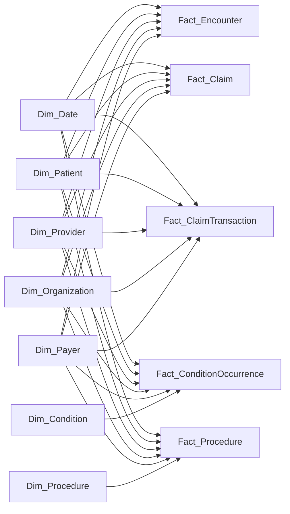

# Synthea V1 Source-to-Target Mapping

**Status: Proposed V1 — Not Yet Implemented**

All proposed grains, keys, relationships, and transformation rules are **Candidate / To Be Validated** unless explicitly described as observed in the 10-patient smoke-test extract.

## 1. Objective

Define a focused source-to-target design for using the existing synthetic Synthea CSV extract in Hospital360. The design separates immutable source capture, typed staging, and analytics-ready dimensional structures without creating database objects or transforming data in this step.

Evidence comes primarily from `docs/data_dictionary/synthea_initial_profile.md` and the 18 CSV files under `data/raw/synthea/csv`. Synthea data is synthetic and must not be presented as real hospital, patient, operational, or financial performance.

## 2. V1 Scope Principles

- Focus V1 on patient activity, encounters, service utilization, limited encounter-level clinical context, claims activity, provider/organization performance, and payer mix.
- Preserve every source row unchanged in the raw layer when ingestion is implemented later.
- Type, standardize, and validate in staging; do not silently repair source values.
- Use surrogate keys in analytics while retaining source natural keys for lineage and reconciliation.
- Model only relationships supported by exact-value evidence in the profile.
- Avoid direct fact-to-fact relationships in the analytical model. Resolve shared patient, encounter, provider, organization, payer, code, and date keys during transformation.
- Defer heterogeneous or specialized clinical domains until the core model and financial semantics are stable.
- Do not treat source aggregate fields as additive until their time basis and reconciliation behavior are validated.

## Architecture Review Decisions

- **Removed `analytics.dim_encounter`.** An encounter is a business event, and `encounters.csv` supplies 283 rows with 283 distinct, nonblank IDs. The event belongs in `analytics.fact_encounter`; the presence of an encounter ID alone does not justify a dimension.
- **Kept encounter classification on the encounter fact for V1.** ENCOUNTERCLASS, CODE, DESCRIPTION, REASONCODE, and REASONDESCRIPTION remain descriptive/degenerate attributes on `fact_encounter`. A future `dim_encounter_type` is **Candidate / To Be Validated** only if stable reusable labels, hierarchies, or cross-source classifications emerge.
- **Encounter ID remains a degenerate lineage identifier.** Claims, transactions, condition occurrences, and procedure facts retain the source encounter ID for traceability. It is not used to create direct fact-to-fact relationships in the semantic model.
- **Confirmed the condition concept/occurrence split.** The extract has 252 condition occurrence rows and 68 distinct nonblank SYSTEM + CODE concepts, with no concept mapped to multiple descriptions. `dim_condition` and `fact_condition_occurrence` are justified for V1, subject to validation on larger extracts.
- **Confirmed the procedure concept/occurrence split.** The extract has 1,003 performed-procedure rows and 66 distinct nonblank SYSTEM + CODE concepts, with no concept mapped to multiple descriptions. `dim_procedure` and `fact_procedure` are justified for V1, subject to validation on larger extracts.
- **Confirmed claim header and transaction grains.** `claims.csv` has 464 unique claim IDs. `claims_transactions.csv` has 5,403 unique transaction IDs, and all 5,403 CLAIMID values resolve to the 464 claim headers. The candidate relationship is one claim header to many claim transaction rows.
- **Documented join multiplication risk.** The 464 claims map to 283 encounters; 117 encounters have multiple claims and the maximum is 6. Every claim has multiple transactions, ranging from 2 to 207 with an average of 11.64. Direct encounter-to-claim or claim-to-transaction fact joins can repeat encounter costs, claim balances, encounter counts, claim counts, and patient counts. Facts must be aggregated independently or enriched with conformed dimension keys in staging.
- **Retained five facts and seven dimensions.** Shared analytical context is provided through Date, Patient, Provider, Organization, Payer, Condition, and Procedure dimensions. No unexplained many-to-many or physical fact-to-fact relationship is introduced.
- **Still To Be Validated:** claim/transaction financial semantics, payer derivation, composite event-key stability, slowly changing dimension behavior, aggregate-field reconciliation, unknown-member rules, and whether a reusable encounter-type dimension becomes necessary.

## 3. Source Classification

| Source CSV | Classification | Business purpose | Inclusion/deferment reason | Main domain |
|---|---|---|---|---|
| `patients.csv` | Core V1 | Patient identity, demographics, location, and synthetic lifetime financial attributes | Required conformed patient entity for all patient-level analysis | Patient |
| `encounters.csv` | Core V1 | Encounter activity, timing, class, participants, payer, and encounter costs | Central activity grain and the strongest shared context across clinical and financial events | Encounter |
| `claims.csv` | Core V1 | Claim header, status, payer/provider context, service dates, and outstanding balances | Required for claim counts, lifecycle/status analysis, and transaction enrichment | Financial |
| `claims_transactions.csv` | Core V1 | Detailed charges, payments, adjustments, transfers, units, and outstanding activity | Required for financial movement analysis; transaction semantics remain provisional | Financial |
| `conditions.csv` | Core V1 | Conditions associated with patients and encounters | Supplies focused clinical context for encounter and utilization analysis | Clinical |
| `procedures.csv` | Core V1 | Procedures delivered during encounters, including base cost | Directly supports service-utilization and procedure-cost analysis | Clinical |
| `organizations.csv` | Supporting V1 | Healthcare organization reference and source summary attributes | Required to describe and group encounters/providers; source summary measures need validation | Provider |
| `providers.csv` | Supporting V1 | Provider reference, specialty, organization, and source activity counts | Required to describe provider activity and link providers to organizations | Provider |
| `payers.csv` | Supporting V1 | Payer reference and source coverage/utilization summaries | Required to describe encounter/claim payer mix; aggregate measures remain provisional | Payer |
| `allergies.csv` | Deferred | Allergy episodes and reactions | Useful clinical detail but not required for V1 activity, utilization, or financial questions | Clinical |
| `careplans.csv` | Deferred | Care-plan episodes and reasons | Adds longitudinal clinical workflow complexity beyond the initial model | Clinical |
| `devices.csv` | Deferred | Implanted/assigned device events and UDI | Specialized device analytics are not a V1 objective | Clinical |
| `imaging_studies.csv` | Deferred | Imaging studies, series, modalities, and procedure codes | Requires imaging-specific grain and code validation | Clinical |
| `immunizations.csv` | Deferred | Immunization events and base cost | Valuable service detail but not necessary for the first utilization model | Clinical |
| `medications.csv` | Deferred | Medication episodes, payer coverage, dispenses, and cost | Medication/order/dispense semantics and cost aggregation require a dedicated design | Clinical |
| `observations.csv` | Deferred | Heterogeneous clinical observations and measurements | Highest-volume clinical source; mixed VALUE types/units and 276 blank encounter references require dedicated modeling | Clinical |
| `payer_transitions.csv` | Deferred | Patient coverage periods and plan ownership | Temporal coverage modeling is useful but unnecessary for initial encounter/claim payer mix | Payer |
| `supplies.csv` | Deferred | Supply-use events and quantities | Supply chain and cost detail are not supported sufficiently for V1 | Other |

No source is excluded in V1. Each deferred file is a valid synthetic source with plausible future analytical value.

## 4. Core Source Profiles

This section explicitly evaluates the 11 requested sources. Grain and key statements are **Candidate / To Be Validated**.

| Source | V1 decision | Observed rows | Candidate source grain | Candidate key/evidence |
|---|---|---:|---|---|
| `patients.csv` | Core | 10 | One synthetic patient | `Id`; 10/10 distinct, no missing IDs |
| `encounters.csv` | Core | 283 | One encounter event | `Id`; 283/283 distinct, no missing IDs |
| `claims.csv` | Core | 464 | One claim header associated with an appointment/encounter | `Id`; 464/464 distinct |
| `claims_transactions.csv` | Core | 5,403 | One claim financial transaction/event line | `ID`; 5,403/5,403 distinct |
| `conditions.csv` | Core | 252 | One condition occurrence/episode | PATIENT + ENCOUNTER + START + CODE; 252/252 distinct in this extract |
| `procedures.csv` | Core | 1,003 | One procedure event | PATIENT + ENCOUNTER + START + CODE; 1,003/1,003 distinct in this extract |
| `medications.csv` | Deferred | 181 | One medication episode/order | PATIENT + ENCOUNTER + START + CODE; unique here, semantics still deferred |
| `observations.csv` | Deferred | 4,246 | One observation result | PATIENT + ENCOUNTER + DATE + CODE + VALUE + UNITS; unique here, heterogeneous values |
| `organizations.csv` | Supporting | 35 | One healthcare organization | `Id`; 35/35 distinct; `NPI` alternate candidate |
| `providers.csv` | Supporting | 35 | One provider | `Id`; 35/35 distinct; `NPI` alternate candidate |
| `payers.csv` | Supporting | 10 | One payer summary row | `Id`; 10/10 distinct |

## 5. Source-to-Target Mapping

The raw and staging names below are proposed PostgreSQL objects only; none exist yet. Raw tables preserve source values as delivered and later add ingestion metadata such as load ID, file name, source row number, and ingestion timestamp.

### 5.1 Patients

- Source CSV: `patients.csv`
- Source grain: **Candidate / To Be Validated** — one synthetic patient.
- Source candidate key: `Id`.
- Important source foreign keys: none.
- Raw table: `raw.synthea_patients`.
- Staging table: `staging.stg_patients`.
- Analytics targets: `analytics.dim_patient`; BIRTHDATE and DEATHDATE also contribute values to `analytics.dim_date`.
- Target type: Dimension.
- Proposed analytical grain: one row per Synthea patient natural key in V1.
- Expected later transformations: parse dates and numeric values; standardize nulls; retain synthetic identifiers; derive non-sensitive age bands only when an as-of-date rule is approved; assign `patient_key`.
- Expected later validations: nonblank/unique `Id`; valid dates; DEATHDATE not before BIRTHDATE; numeric parsing for coordinates, expenses, coverage, and income.
- Open questions/risks: SCD strategy; treatment of synthetic PII-like fields; whether lifetime financial attributes are snapshot measures or should remain staging-only.

### 5.2 Encounters

- Source CSV: `encounters.csv`
- Source grain: **Candidate / To Be Validated** — one encounter event.
- Source candidate key: `Id`.
- Important source foreign keys: PATIENT, ORGANIZATION, PROVIDER, PAYER.
- Raw table: `raw.synthea_encounters`.
- Staging table: `staging.stg_encounters`.
- Analytics targets: `analytics.fact_encounter` and `analytics.dim_date`.
- Target type: Fact.
- Proposed analytical grain: one row per encounter natural key with measures, descriptive encounter attributes, and role-playing date keys.
- Expected later transformations: parse UTC timestamps; derive duration; standardize class/code text; resolve conformed patient, organization, provider, payer, and date surrogate keys; cast cost/coverage measures.
- Expected later validations: unique/nonblank `Id`; START <= STOP; required patient reference; exact reference resolution; numeric parsing; candidate reconciliation of TOTAL_CLAIM_COST and PAYER_COVERAGE.
- Open questions/risks: whether encounter CODE and ENCOUNTERCLASS warrant separate reference dimensions; whether source cost fields overlap claim facts.

### 5.3 Claims

- Source CSV: `claims.csv`
- Source grain: **Candidate / To Be Validated** — one claim header.
- Source candidate key: `Id`.
- Important source foreign keys: PATIENTID, PROVIDERID, PRIMARYPATIENTINSURANCEID, SECONDARYPATIENTINSURANCEID, REFERRINGPROVIDERID, SUPERVISINGPROVIDERID, APPOINTMENTID.
- Raw table: `raw.synthea_claims`.
- Staging table: `staging.stg_claims`.
- Analytics target: `analytics.fact_claim` plus role-playing keys to `analytics.dim_date`.
- Target type: Fact.
- Proposed analytical grain: one row per claim header `Id`.
- Expected later transformations: parse service/illness/billed timestamps; cast outstanding balances; resolve patient, provider, organization, payer, and date keys through validated staging joins; retain claim ID and APPOINTMENTID as degenerate lineage identifiers; standardize status attributes.
- Expected later validations: unique/nonblank `Id`; nonblank PATIENTID; exact patient/encounter/provider matches; validate payer references when populated; validate status domains and timestamp order.
- Open questions/risks: APPOINTMENTID matched `encounters.Id` 464/464 but its formal semantics remain to be confirmed; 124 primary payer values are blank; DIAGNOSIS1-8 are retained in raw/staging and are not forced into a V1 many-to-many bridge.

### 5.4 Claim Transactions

- Source CSV: `claims_transactions.csv`
- Source grain: **Candidate / To Be Validated** — one claim financial transaction/event line.
- Source candidate key: `ID`.
- Important source foreign keys: CLAIMID, PATIENTID, APPOINTMENTID, PLACEOFSERVICE, PROVIDERID, SUPERVISINGPROVIDERID; other ID-like fields remain provisional.
- Raw table: `raw.synthea_claims_transactions`.
- Staging table: `staging.stg_claims_transactions`.
- Analytics target: `analytics.fact_claim_transaction` plus role-playing date keys.
- Target type: Fact.
- Proposed analytical grain: one row per source transaction `ID`.
- Expected later transformations: parse FROMDATE/TODATE; cast monetary and unit fields without automatically replacing blanks with zero; standardize TYPE/METHOD; enrich conformed patient, organization, provider, payer, and date keys through validated staging joins; retain CLAIMID and APPOINTMENTID as degenerate lineage identifiers.
- Expected later validations: unique/nonblank `ID`; CLAIMID resolves to claims; patient/encounter/place/provider references resolve; FROMDATE <= TODATE; transaction-type-specific completeness and financial reconciliation rules.
- Open questions/risks: sign and null semantics for AMOUNT, PAYMENTS, ADJUSTMENTS, TRANSFERS, and OUTSTANDING; meaning of CHARGEID and TRANSFEROUTID; payer resolution should use validated claim context rather than assume PATIENTINSURANCEID equals `payers.Id`.

### 5.5 Conditions

- Source CSV: `conditions.csv`
- Source grain: **Candidate / To Be Validated** — one condition occurrence/episode for a patient and encounter.
- Source candidate key: PATIENT + ENCOUNTER + START + CODE; uniqueness was observed only in the smoke test.
- Important source foreign keys: PATIENT, ENCOUNTER.
- Raw table: `raw.synthea_conditions`.
- Staging table: `staging.stg_conditions`.
- Analytics targets: `analytics.dim_condition`, `analytics.fact_condition_occurrence`, and `analytics.dim_date`.
- Target type: Dimension plus Fact.
- Proposed analytical grain: one condition dimension row per SYSTEM + CODE; one occurrence fact row per source condition occurrence.
- Expected later transformations: parse dates; resolve patient, condition, and date keys; retain ENCOUNTER as a degenerate lineage identifier; optionally stamp validated provider/organization/payer context from staging encounters; create a stable ingestion row key or row hash.
- Expected later validations: required PATIENT/ENCOUNTER/CODE/START; patient and encounter reference resolution; START <= STOP when STOP is populated; description consistency within SYSTEM + CODE.
- Open questions/risks: composite event key may collide in larger extracts; STOP can represent resolution and may be null; condition descriptions may change across Synthea versions.

### 5.6 Procedures

- Source CSV: `procedures.csv`
- Source grain: **Candidate / To Be Validated** — one procedure event for a patient and encounter.
- Source candidate key: PATIENT + ENCOUNTER + START + CODE; uniqueness was observed only in the smoke test.
- Important source foreign keys: PATIENT, ENCOUNTER.
- Raw table: `raw.synthea_procedures`.
- Staging table: `staging.stg_procedures`.
- Analytics targets: `analytics.dim_procedure`, `analytics.fact_procedure`, and `analytics.dim_date`.
- Target type: Dimension plus Fact.
- Proposed analytical grain: one procedure dimension row per SYSTEM + CODE; one procedure fact row per source procedure occurrence.
- Expected later transformations: parse timestamps; cast BASE_COST; resolve patient, procedure, and date keys; retain ENCOUNTER as a degenerate lineage identifier; optionally stamp validated provider/organization/payer context from staging encounters; derive duration where meaningful; create a stable ingestion event key.
- Expected later validations: required references/code/start; exact patient/encounter matches; START <= STOP; valid numeric BASE_COST; description consistency by SYSTEM + CODE.
- Open questions/risks: repeated same-code procedures at the same timestamp may require source-row lineage; BASE_COST relationship to encounter/claim costs must be reconciled before combined financial reporting.

### 5.7 Organizations

- Source CSV: `organizations.csv`
- Source grain: **Candidate / To Be Validated** — one healthcare organization.
- Source candidate key: `Id`; `NPI` is an alternate candidate.
- Important source foreign keys: none.
- Raw table: `raw.synthea_organizations`.
- Staging table: `staging.stg_organizations`.
- Analytics target: `analytics.dim_organization`.
- Target type: Dimension.
- Proposed analytical grain: one row per organization natural key in V1.
- Expected later transformations: standardize address/state/ZIP/phone; cast coordinates; assign `organization_key`; retain NPI and source ID.
- Expected later validations: unique/nonblank `Id`; NPI format and uniqueness; coordinate parsing; duplicate organization assessment.
- Open questions/risks: SCD strategy; REVENUE and UTILIZATION appear to be source summaries and should not become additive dimension measures without a dated snapshot design.

### 5.8 Providers

- Source CSV: `providers.csv`
- Source grain: **Candidate / To Be Validated** — one provider.
- Source candidate key: `Id`; `NPI` is an alternate candidate.
- Important source foreign key: ORGANIZATION.
- Raw table: `raw.synthea_providers`.
- Staging table: `staging.stg_providers`.
- Analytics target: `analytics.dim_provider`.
- Target type: Dimension.
- Proposed analytical grain: one row per provider natural key in V1.
- Expected later transformations: standardize specialty and location fields; cast coordinates; resolve home organization; assign `provider_key`.
- Expected later validations: unique/nonblank `Id`; NPI format/uniqueness; ORGANIZATION resolves; specialty completeness.
- Open questions/risks: providers may change organizations over time; source ENCOUNTERS and PROCEDURES are summaries and should not be combined with facts without reconciliation.

### 5.9 Payers

- Source CSV: `payers.csv`
- Source grain: **Candidate / To Be Validated** — one payer summary row.
- Source candidate key: `Id`.
- Important source foreign keys: none.
- Raw table: `raw.synthea_payers`.
- Staging table: `staging.stg_payers`.
- Analytics target: `analytics.dim_payer`.
- Target type: Dimension.
- Proposed analytical grain: one row per payer natural key in V1.
- Expected later transformations: standardize name/ownership/contact fields; cast summary measures for validation only; assign `payer_key`.
- Expected later validations: unique/nonblank `Id`; ownership domain; numeric parsing; reconciliation of aggregate counts and amounts to event facts where definitions permit.
- Open questions/risks: source financial/utilization values may be run-level summaries rather than durable dimension attributes; payer history from `payer_transitions.csv` is deferred.

### 5.10 Date Dimension

`analytics.dim_date` has no single source CSV. It will be generated later from the bounded date range across selected staging date/timestamp columns. This is a proposed generated dimension, not a transformed copy of one source.

## 6. Proposed V1 Star Schema

**Proposed V1 — Not Yet Implemented**

| Analytical target | Type | Business entity/event | Candidate natural key |
|---|---|---|---|
| `analytics.dim_date` | Dimension | Calendar date | Calendar date / integer YYYYMMDD |
| `analytics.dim_patient` | Dimension | Synthetic patient | patients.Id |
| `analytics.dim_provider` | Dimension | Provider | providers.Id; NPI alternate candidate |
| `analytics.dim_organization` | Dimension | Healthcare organization | organizations.Id; NPI alternate candidate |
| `analytics.dim_payer` | Dimension | Payer | payers.Id |
| `analytics.dim_condition` | Dimension | Condition code concept | conditions.SYSTEM + conditions.CODE |
| `analytics.dim_procedure` | Dimension | Procedure code concept | procedures.SYSTEM + procedures.CODE |
| `analytics.fact_encounter` | Fact | Encounter activity and cost | encounters.Id retained for lineage |
| `analytics.fact_claim` | Fact | Claim header/status snapshot | claims.Id retained for lineage |
| `analytics.fact_claim_transaction` | Fact | Claim financial transaction/event line | claims_transactions.ID retained for lineage |
| `analytics.fact_condition_occurrence` | Fact | Condition occurrence/episode | Candidate source composite plus ingestion row key |
| `analytics.fact_procedure` | Fact | Procedure occurrence | Candidate source composite plus ingestion row key |

The diagram shows logical many-to-one fact-to-dimension relationships. It does not authorize direct fact-to-fact joins. Encounter IDs are retained on facts as degenerate lineage identifiers. Where dependent facts need provider, organization, or payer context, those keys are stamped through one validated staging encounter-context rule rather than by relating facts in the analytical model.

## 7. Fact Grains

Every grain and key is **Candidate / To Be Validated**.

| Fact | Explicit grain | Candidate business key | Foreign keys and degenerate identifiers | Supported measures |
|---|---|---|---|---|
| `analytics.fact_encounter` | **One row = one source encounter event.** | encounters.Id | patient_key, provider_key, organization_key, payer_key, start_date_key, stop_date_key; encounter Id retained | encounter_count = 1; BASE_ENCOUNTER_COST; TOTAL_CLAIM_COST; PAYER_COVERAGE; duration derived from START/STOP |
| `analytics.fact_claim` | **One row = one source claim header.** | claims.Id | patient_key, provider/referring/supervising provider keys where resolved, organization_key via validated encounter context, primary/secondary payer keys where resolved, service/illness/last-billed date keys; claim Id and APPOINTMENTID retained | claim_count = 1; OUTSTANDING1; OUTSTANDING2; OUTSTANDINGP |
| `analytics.fact_claim_transaction` | **One row = one source claim financial transaction/event line.** | claims_transactions.ID | patient_key, provider/supervising provider keys, organization_key, payer_key via validated claim context, from/to date keys; transaction ID, CLAIMID, and APPOINTMENTID retained | transaction_count = 1; AMOUNT; UNITS; UNITAMOUNT; PAYMENTS; ADJUSTMENTS; TRANSFERS; OUTSTANDING, interpreted by TYPE |
| `analytics.fact_condition_occurrence` | **One row = one recorded condition occurrence/episode for a patient and encounter.** | PATIENT + ENCOUNTER + START + CODE, plus source-row lineage | patient_key, condition_key, start_date_key, stop_date_key; ENCOUNTER retained; contextual provider/organization/payer keys only if stamped through the validated encounter rule | condition_occurrence_count = 1 |
| `analytics.fact_procedure` | **One row = one performed procedure occurrence for a patient and encounter.** | PATIENT + ENCOUNTER + START + CODE, plus source-row lineage | patient_key, procedure_key, start_date_key, stop_date_key; ENCOUNTER retained; contextual provider/organization/payer keys only if stamped through the validated encounter rule | procedure_count = 1; BASE_COST; duration derived from START/STOP where meaningful |

## 8. Dimension Keys

All dimension keys are **Candidate / To Be Validated**. Analytics tables should use generated integer surrogate keys while retaining these natural keys.

| Dimension | Proposed surrogate key | Candidate natural key | Notes |
|---|---|---|---|
| `dim_date` | `date_key` | Calendar date | Role-playing keys for start, stop, service, illness, billed, and transaction dates |
| `dim_patient` | `patient_key` | patients.Id | Synthetic identity; SCD strategy unresolved |
| `dim_provider` | `provider_key` | providers.Id | NPI retained as alternate candidate |
| `dim_organization` | `organization_key` | organizations.Id | NPI retained as alternate candidate |
| `dim_payer` | `payer_key` | payers.Id | Unknown/self-pay member required for unresolved or blank payer references |
| `dim_condition` | `condition_key` | SYSTEM + CODE | Description is descriptive, not part of the proposed key |
| `dim_procedure` | `procedure_key` | SYSTEM + CODE | Description is descriptive, not part of the proposed key |

## 9. Candidate Relationships

All relationships are **Candidate / To Be Validated**. The counts below are observed exact matches from the smoke-test profile.

| Staging relationship | Stated keys | Evidence | Proposed analytics use |
|---|---|---|---|
| encounters to patients | stg_encounters.PATIENT = stg_patients.Id | 283/283 matched | patient_key on encounter fact/dimension |
| encounters to organizations | ORGANIZATION = organizations.Id | 283/283 matched | organization_key on encounter fact/dimension |
| encounters to providers | PROVIDER = providers.Id | 283/283 matched | provider_key on encounter fact/dimension |
| encounters to payers | PAYER = payers.Id | 283/283 matched | payer_key on encounter fact/dimension |
| providers to organizations | providers.ORGANIZATION = organizations.Id | 35/35 matched | organization_key attribute on dim_provider |
| claims to patients | claims.PATIENTID = patients.Id | 464/464 matched | patient_key on fact_claim |
| claims to encounters | claims.APPOINTMENTID = encounters.Id | 464/464 matched | retain encounter ID and enrich context in staging; no analytics fact-to-fact relationship |
| claims to providers | claims.PROVIDERID = providers.Id | 464/464 matched | provider_key on fact_claim |
| claims to primary payer | PRIMARYPATIENTINSURANCEID = payers.Id | 340/340 nonblank matched; 124 blank | payer_key or explicit unknown/self-pay member |
| transactions to claims | transactions.CLAIMID = claims.Id | 5,403/5,403 matched | staging enrichment only; no direct analytics fact-to-fact relationship |
| transactions to patients | transactions.PATIENTID = patients.Id | 5,403/5,403 matched | patient_key on fact_claim_transaction |
| transactions to encounters | transactions.APPOINTMENTID = encounters.Id | 5,403/5,403 matched | retain encounter ID and enrich context in staging; no analytics fact-to-fact relationship |
| transactions to organizations | transactions.PLACEOFSERVICE = organizations.Id | 5,403/5,403 matched | organization_key on fact_claim_transaction |
| transactions to providers | transactions.PROVIDERID = providers.Id | 5,403/5,403 matched | provider_key on fact_claim_transaction |
| conditions to patients | conditions.PATIENT = patients.Id | 252/252 matched | patient_key on condition occurrence fact |
| conditions to encounters | conditions.ENCOUNTER = encounters.Id | 252/252 matched | retain encounter ID and optionally stamp validated context in staging |
| procedures to patients | procedures.PATIENT = patients.Id | 1,003/1,003 matched | patient_key on procedure fact |
| procedures to encounters | procedures.ENCOUNTER = encounters.Id | 1,003/1,003 matched | retain encounter ID and optionally stamp validated context in staging |

No unexplained many-to-many relationship is proposed. Multi-valued claim diagnosis columns remain raw/staging-only in V1. Fact-to-fact enrichment occurs in staging before loading conformed foreign keys; analytical queries should not join facts directly by natural IDs.

## 10. Data Quality Requirements

- File-level: expected file/header checks, load ID, file checksum, row count, source row number, and reject/quarantine reporting.
- Raw integrity: preserve source text and raw files; never overwrite the original synthetic CSVs.
- Key checks: required source IDs, uniqueness for supplied IDs, and duplicate reporting for candidate composites.
- Reference checks: resolve every populated selected foreign key; use explicit unknown members rather than dropping rows when a permissible reference is blank.
- Temporal checks: parse ISO dates/timestamps; enforce START <= STOP and FROMDATE <= TODATE where both exist; document UTC assumptions.
- Numeric checks: parse monetary, count, coordinate, and duration inputs; do not assume negative or blank financial values are invalid without transaction-type rules.
- Code checks: require code system with condition/procedure codes where available and monitor description drift by code.
- Financial checks: define TYPE-specific claim transaction rules and reconcile claim/encounter/transaction measures before publishing totals.
- Synthetic-data controls: clearly label all outputs as synthetic; do not use them for clinical decisions, real patient inference, or claims/payment decisions.
- Regression checks: preserve the smoke-test baseline counts and exact reference-match rates as test fixtures, not production expectations.

## 11. Analytical Questions Supported

Subject to validation and implementation, the proposed V1 model supports:

- Synthetic patient count and patient activity over time.
- Encounter volume by date, encounter class, organization, provider, payer, and patient attributes.
- Average and distribution of encounter duration from validated START/STOP timestamps.
- Encounter base cost, total claim cost, and payer coverage trends, with overlap caveats.
- Provider activity by organization and specialty using encounter/procedure facts.
- Organization activity and service mix.
- Payer mix based on encounter payer and populated claim primary payer references.
- Claim count, status, outstanding balance, and service-date trends.
- Claim transaction counts and monetary movements by validated transaction type, payer, provider, organization, and encounter after semantic rules are approved.
- Procedure volume and base cost by procedure code, encounter, provider context, organization, payer context, and date.
- Conditions associated with encounters and patients, including condition prevalence within this synthetic extract.

## 12. Analytical Questions Not Yet Supported

Synthea V1 does not supply the custom operational, workforce, budget, and technology datasets required for:

- Budget vs Actual.
- Operating Expenses.
- Department Profitability.
- Bed Occupancy.
- Staff Utilization.
- Overtime.
- Appointment No-show.
- IT Uptime.
- IT Tickets.
- Device Downtime.

These require separately designed synthetic finance, HR, capacity, scheduling, and IT sources. They must not be inferred from current Synthea fields.

## 13. Open Questions / To Be Validated

1. **Candidate / To Be Validated:** Confirm that claims.APPOINTMENTID is formally the Synthea encounter identifier across exporter versions, despite the 464/464 match here.
2. **Candidate / To Be Validated:** Define transaction TYPE, sign, blank, transfer, payment, adjustment, and outstanding-balance semantics before publishing financial measures.
3. **Candidate / To Be Validated:** Decide how claim primary/secondary insurance and transaction PATIENTINSURANCEID map to payers; do not assume equivalence without evidence.
4. **Candidate / To Be Validated:** Determine whether ENCOUNTERCLASS/CODE later require a reusable `dim_encounter_type`; V1 keeps them on `fact_encounter`.
5. **Candidate / To Be Validated:** Validate composite condition/procedure event keys on larger and repeated-generation extracts; prefer ingestion row lineage over deduplication by assumption.
6. **Candidate / To Be Validated:** Select SCD behavior for patient, provider, organization, and payer dimensions.
7. **Candidate / To Be Validated:** Determine whether organization/provider/payer aggregate fields are run-level snapshots and whether they should remain staging-only.
8. **Candidate / To Be Validated:** Define unknown, self-pay, missing-provider, and unresolved-reference dimension members.
9. **Candidate / To Be Validated:** Determine whether encounter costs, procedure base costs, claim balances, and transaction amounts can reconcile without double counting.
10. **Candidate / To Be Validated:** Design later models for medications and observations, including the 276 blank observation ENCOUNTER values, before promoting those sources into V1 analytics.
11. **Candidate / To Be Validated:** Decide whether claim diagnosis slots require a future bridge and validate their code system before relating them to `dim_condition`.

## 14. Next Recommended Step

Review and approve this V1 scope, fact grains, conformed dimensions, and open validation questions. After approval, create a column-level logical specification for the nine selected sources—including target columns, data types, nullability, derivation rules, lineage fields, and test cases—before writing or executing PostgreSQL DDL.

No database objects, transformations, patient generation, or raw-data changes were performed as part of this design.
